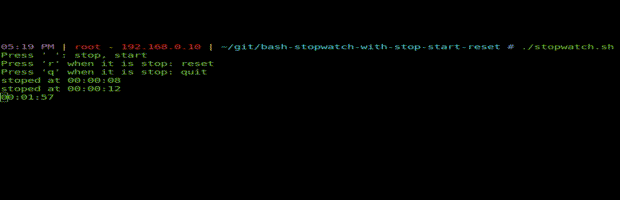

# Bash Stopwatch (Stop, Start, Reset)

For basic bash stopwatch script, thank to [superuser user](https://superuser.com/questions/611538/is-there-a-way-to-display-a-countdown-or-stopwatch-timer-in-a-terminal?answertab=votes#tab-top "superuser user"). 

For key pressing function in running infinite while loop, thanks to [stackoverflow user](https://stackoverflow.com/questions/5297638/bash-how-to-end-infinite-loop-with-any-key-pressed?answertab=votes#tab-top "stackoverflow user")

[In this script](stopwatch.sh "In this script"), interrupt time sum function is added.



## The keys:
**whitespace**: stop/start
**r**: reset (when it is stop)
**q**: quit (when it is stop)

```bash
$ git clone https://github.com/inceabdullah/Bash-Stopwatch-with-Stop-Start-Reset.git
$ cd Bash-Stopwatch-with-Stop-Start-Reset
$ chmod +x stopwatch.sh
$ sudo cp stopwatch.sh /usr/bin/stopwatch
```


`$ stopwatch`